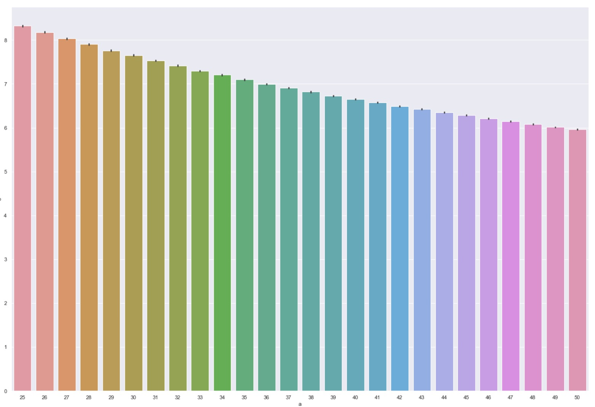
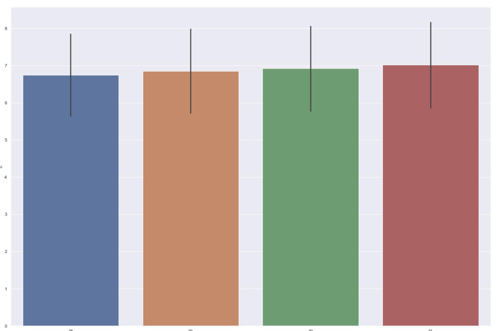
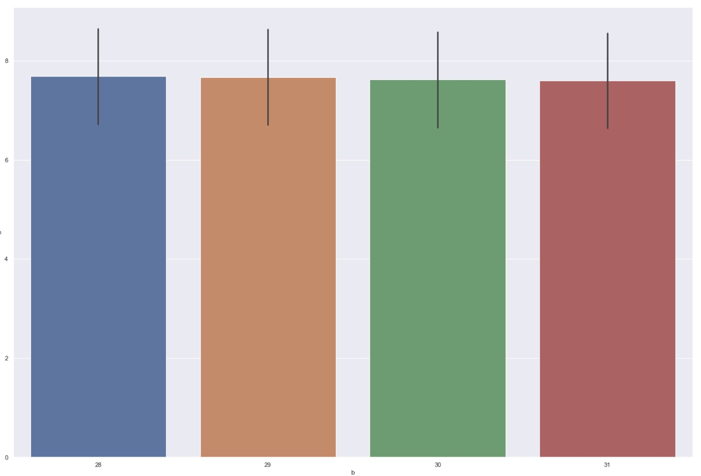
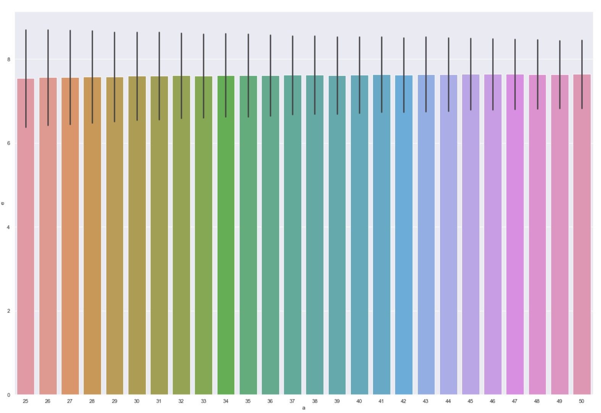
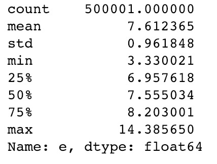
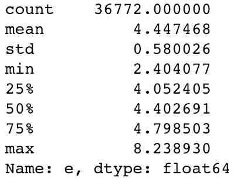
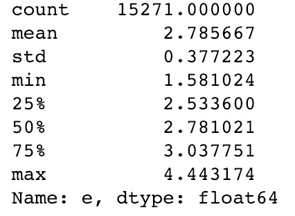

# Hospital Employee Schedule

## Overview

For this project, I wanted to produce a schedule for 4 wards in a Hospital, given the number of employees. There are rules on how to assign work to each employee and also take care of employees who'll be on leave.

## Requirements and Installation
In order to run these scripts, you'll need the following libraries.

* [NumPy](https://docs.scipy.org/doc/numpy/user/install.html)
* [Pandas](https://pandas.pydata.org/pandas-docs/stable/install.html)

## Rules

These are the rules that must be followed:

1. Four coloured team
2. Each team must be covered by 1 person everyday
* On weekdays, one employee can cover 2 teams
* On weekends, employees can only be on one team, but can cover 2 teams if in gold
* One cannot do both Red and Blue on weekends
* An employee cannot work for 3 weekends in a row
* Different days of the week have score. More the score, less ideal to work on:

| Saturday |Sunday | Tuesday |Thursday |Wednesday |Monday | Friday |
|----------|-------|---------|---------|----------|-------|--------|
| 5        |   4   |    3    |    2    |    2     |    1  |   1    |

* Design the algorithm to find the best schedule based on the lowest overall total
* Some employees will request days off, they should not be penalized to have more work

Our aim is to assign work, such that the total score for each employee at the end of the month should not differ a lot, i.e. reduce the standard deviation.

## Implementation

### Random Selection

At first I created the code such that all the rules are followed and assigned employees work randomly.

  ```bash
  assign_schedule('random')
  ```

This was to check if the schedule followed all the rules mentioned above. The month and year were selected at random.

Example 1             |  Example 2
:-------------------------:|:-------------------------:
  |  

I ran these several times and stored the ```std``` in ```std-random.csv```. Plotting the ```std``` with the number of employees(chosen randomly) of the month revealed this graph.





Also, plotting the ```std``` with the number of days in the month(chosen randomly) of the month revealed this graph.





It can be seen that the ```std``` decreases with increased number of employees and increases with increased number of days.
I had to correct this metric by multiplying with the square-root of number of employees and dividing by the square-root of number of days. This fixed the issue and I go the following graph as the revised metric to measure.








After fixing the evaluation metric, we can now measure the performance of the system.



We see the mean ```std``` at 7.6, which is a bad result as expected. This is because we are randomly assigning work to the employees.

### Weighted Selection

Now I added some bais while selecting. The employees were given a weight, based on the amount of '''score''' they currently have done. Employees who had done work (and had a higher '''score'''), were less likely to be chosen again

  ```bash
  assign_schedule('weighted')
  ```

This the difference in results obtained.



We see the mean '''std''' change to  4.44, which is an improvement to random selection, as expected.

### Best Selection

I further modified the bais while selecting. The employee selection was based on the one who had the least '''score'''. Employees who had done least amount of work, were selected.

  ```bash
  assign_schedule('best')
  ```

This the difference in results obtained.



We see the mean ```std``` further improve to to  2.7, which is an improvement to weighted selection.

### Future work

I am trying to implement this using Machine Learning, to get the reduce the ```std``` even further and get better results.

## How you can run

1. Download and unzip [this entire repository from GitHub](https://github.com/suhail511/employee-schedule), either interactively, or by entering the following in your Terminal.

    ```bash
    git clone https://github.com/suhail511/employee-schedule
    ```

2. Navigate into the top directory of the repo on your machine
    ```bash
    cd employee-schedule
    ```

Enter the year and month, it will produce a schedule for random number of employees.

**Please let me know if you have any issues or if you have any suggestions for making this README better. If you thought a certain step was unclear, let me know and I'll try my best to edit the README and make any clarifications.**
